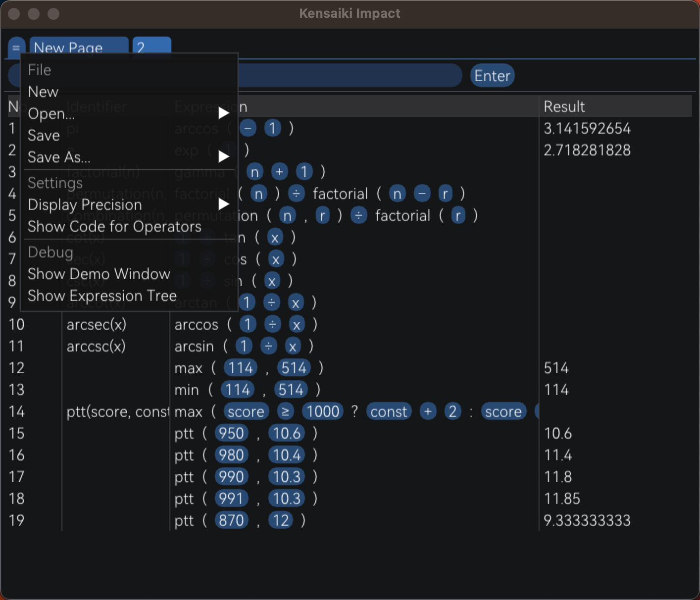

# `kensaiki-impact`
你说得对，但是《**原子之算**》（原算，Kensaiki Impact）是一款计算器软件。支持 26 种运算符、41 种内建函数、将中间运算结果保存到变量、创建自定义函数、将计算过程保存为文件。



## 构建与使用
```sh
mkdir build
cd build
cmake ..
make
./Kensaiki-Impact
```

## 表达式语法
### 字面量
最简单的表达式只含一个字面量或变量。《原算》支持的字面量有以下类型：

| 字面量类型 | Unix 正则表达式 | 例 |
| --- | --- | --- |
| 二进制整数 | `0[Bb][0-1]+` | `0b1010` |
| 八进制整数 | `0[Oo][0-7]+` | `0o777` |
| 十进制整数 | `[0-9]+` | `114514` |
| 十六进制整数 | `0[Xx][A-Fa-f0-9]+` | `0XFF` |
| 十进制小数 | `[0-9]*\.[0-9]+` | `.142857` |
| 十进制指数 | `(?:[0-9]*\.)?[0-9]+[eE][+-]?[0-9]+` | `6.022e23` |

输入并执行表达式后，可以点击表达式中的字面量进行修改。

### 表达式类型
输入并执行表达式后，其运算结果会实时显示在表达式右侧，并根据其类型显示为适当的格式。在《原算》中，表达式的类型有二进制、八进制、十进制、十六进制和布尔型五种。

如果布尔型表达式的实际值与 0 不相等，将显示为 `True`，否则显示为 `False`。

无论表达式的类型为何，《原算》内部均使用 C++ `double` 类型进行运算，在进行比较时保留 9 位精度；在作为十进制类型显示时默认保留 9 位精度，可在菜单「Display Precision」选项处更改。

### 运算符
若干个表达式可以用运算符连接为更复杂的表达式。下面按优先级从高到低的顺序给出《原算》支持的所有运算符。所有运算符的结合性均为左结合。

| 优先级 | 名称 | 符号 | 类型 |
|:---:|:---:|:---:|:---:|
| 1 | 括号 | `(a)` | 保持 |
| 2 | 幂 | `a ** b` | 保持或十进制 |
| 3 | 正 | `+a` | 保持 |
|| 负 | `-a` | 保持 |
|| 按位非 | `~a` | 保持 |
| 4 | 乘 | `a * b` | 保持或十进制 |
|| 除 | `a / b` | 保持或十进制 |
|| 整除 | `a // b` | 保持或十进制 |
|| 模 | `a % b` | 保持或十进制 |
| 5 | 加 | `a + b` | 保持或十进制 |
|| 减 | `a - b` | 保持或十进制 |
| 6 | 左移 | `a << b` | 同 `a` |
|| 右移 | `a >> b` | 同 `a` |
| 7 | 按位与 | `a & b` | 保持或十进制 |
| 8 | 按位异或 | `a ^ b` | 保持或十进制 |
| 9 | 按位或 | `a \| b` | 保持或十进制 |
| 10 | 小于 | `a < b` | 布尔型 |
|| 大于 | `a > b` | 布尔型 |
|| 等于 | `a = b` | 布尔型 |
|| 大于等于 | `a >= b` | 布尔型 |
|| 小于等于 | `a <= b` | 布尔型 |
|| 不等于 | `a != b` | 布尔型 |
| 11 | 逻辑非 | `!a` | 布尔型 |
| 12 | 逻辑与 | `a && b` | 布尔型 |
| 13 | 逻辑或 | `a \|\| b` | 布尔型 |
| 14 | 条件 | `a ? b : c` | 保持 |

上表中：

- 「保持或十进制」意为当两运算数的类型相同时，运算结果的类型与两运算数的类型相同，否则运算结果为十进制。
- 「保持」意为运算结果的类型与唯一的运算数（对于一元运算符）或所输出的运算数（对于条件运算符）的类型相同。
- 对于类型为布尔型的运算符，其运算结果的实际值始终为 0 或 1。

以上注释也适用于下表。

输入并执行表达式后，可以点击表达式中的一元与二元运算符，将其修改为参数数量相同的其他运算符。

### 内建函数
除了上述 26 种运算符，《原算》还包含 41 种内建函数，方便进行科学计算。为输入方便，部分内建函数拥有别名，但会在语义分析时被替换为学名。

出于精度考虑，`log(a, b)` 函数在 `a` 与 2 或 10 相等时，实际调用 `lb(b)` 与 `lg(b)` 进行运算。此外，为使 `random` 函数的返回值可以变化，该函数拥有一个与输出完全无关的参数。

| 名称 | 函数 | 别名 | 运算结果类型 |
|:---:|:---:|:---:|:---:|
| 绝对值 | `abs(x)` || 保持 |
| 最大值 | `max(a, b)` || 保持 |
| 最小值 | `min(a, b)` || 保持 |
| 算术平方根 | `sqrt(x)` || 十进制 |
| 立方根 | `cbrt(x)` || 十进制 |
| 正弦 | `sin(x)` || 十进制 |
| 余弦 | `cos(x)` || 十进制 |
| 正切 | `tan(x)` | `tg` | 十进制 |
| 反正弦 | `arcsin(x)` | `asin` | 十进制 |
| 反余弦 | `arccos(x)` | `acos` | 十进制 |
| 反正切 | `arctan(x)` | `atan, arctg, atg` | 十进制 |
| 双曲正弦 | `sinh(x)` || 十进制 |
| 双曲余弦 | `cosh(x)` || 十进制 |
| 双曲正切 | `tanh(x)` | `tgh` | 十进制 |
| 反双曲正弦 | `arcsinh(x)` | `asinh` | 十进制 |
| 反双曲余弦 | `arccosh(x)` | `acosh` | 十进制 |
| 反双曲正切 | `arctanh(x)` | `atanh, arctanh, atgh` | 十进制 |
| 误差 | `erf(x)` || 十进制 |
| 反误差 | `erfc(x)` || 十进制 |
| e 的指数 | `exp(x)` || 十进制 |
| 自然对数 | `ln(x)` | `loge` | 十进制 |
| 常用对数 | `lg(x)` | `log10` | 十进制 |
| 2 的对数 | `lb(x)` | `log2` | 十进制 |
| 对数 | `log(a, b)` || 十进制 |
| 向下取整 | `floor(x)` || 十进制 |
| 向上取整 | `ceil(x)` | `ceiling` | 十进制 |
| 四舍五入 | `round(x)` | `rnd` | 十进制 |
| 向 0 取整 | `trunc(x)` | `int` | 十进制 |
| Γ 函数 | `gamma(x)` || 十进制 |
| 转十进制 | `toDec(x)` || 十进制 |
| 转二进制 | `toBin(x)` || 二进制 |
| 转八进制 | `toOct(x)` || 八进制 |
| 转十六进制 | `toHex(x)` || 十六进制 |
| 转布尔型 | `is(x)` | `toBool` | 布尔型 |
| 是否无限 | `isInf(x)` || 布尔型 |
| 是否非正规 | `isNan(x)` || 布尔型 |
| 随机数 | `random(x)` || 十进制 |
| 最大公约数 | `gcd(a, b)` || 保持或十进制 |
| 最小公倍数 | `lcm(a, b)` || 保持或十进制 |
| 角度转弧度 | `rad(x)` | `radius` | 十进制 |
| 弧度转角度 | `deg(x)` | `degree` | 十进制 |

### 变量
通过将表达式定义为一个变量，可以使多步运算的表达式更清晰，并便于重复使用中间运算结果。符号 `:=` 用于定义一个变量：

```kensaiki
<Identifier> := <Expression>
```

其中，标识符 `Identifier` 由一到多个下划线（`_`）、拉丁字母或阿拉伯数字组成，且不以阿拉伯数字开头、不与内建函数及其别名同名、不与已有的变量与函数同名。

### 函数
当需要重复使用一个计算过程，或者需要同时进行多个类似计算时，可以使用自定义函数。符号 `:=` 和 `=>` 组合用于定义一个函数：

```kensaiki
<Identifier> := <Arguments> => <Expression>
```

其中，参数表 `Arguments` 是由逗号（`,`）分割的标识符列表；函数体表达式 `Expression` 中，可以使用已定义过的函数或变量，以及在参数表中出现过的标识符。

注意：当函数表达式中出现同时与函数参数和变量匹配的标识符时，认为该标识符是函数参数。此外，在函数表达式中不能调用该函数自身，即不支持递归函数。

## 例子
### 自定义一些常量和函数
```kensaiki
pi := arccos(-1)
e := exp(1)
fact := n => gamma(n + 1)
P := n, r => fact(n) / fact(n - r)
C := n, r => P(n, r) / fact(r)
cot := x => 1 / tan(x)
sec := x => 1 / cos(x)
csc := x => 1 / sin(x)
arccot := x => arctan(1 / x)
arcsec := x => arccos(1 / x)
arccsc := x => arcsin(1 / x)
```

### 一个 Arcaea 单曲 PTT 计算器
```kensaiki
ptt := score, const => max(score >= 1000 ? const + 2 : score >= 980 ? const + 1 + (score - 980) / 20 : const + (score - 950) / 30, 0)
ptt(950, 10.6)
ptt(980, 10.4)
ptt(990, 10.3)
ptt(991, 10.3)
ptt(870, 12)
```